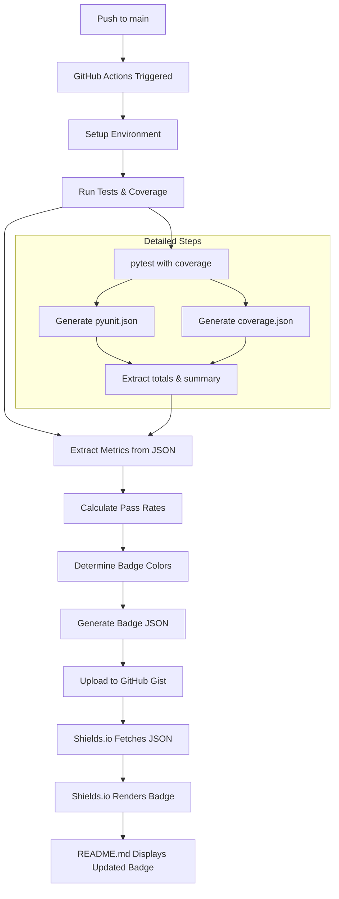

# Dynamic Badge Generation for README.md

## Overview

This document describes the project's practice for creating and maintaining dynamic badges that display real-time project metrics in the README.md file. The badge system provides instant visual feedback on code quality, test coverage, and project health using automated CI/CD workflows.

The system leverages GitHub Actions, GitHub Gists, and shields.io to create a robust, automated badge generation pipeline that updates badges in real-time based on project metrics.

## Current Badge Implementation

### Badge Display in README.md

The project README.md displays four key badges:

```markdown
[](https://www.python.org/downloads/release/python-3132/)
&nbsp;&nbsp;&nbsp;
&nbsp;&nbsp;&nbsp;
&nbsp;&nbsp;&nbsp;
```

### Badge Types and Sources

| Badge | Type | Source | Purpose |
|-------|------|--------|---------|
| **Python Version** | Static | shields.io | Shows supported Python version |
| **Checkin Tests** | GitHub Action | GitHub workflow status | Shows CI/CD pipeline status |
| **Coverage** | Dynamic | GitHub Gist endpoint | Shows test coverage percentage |
| **Unit Tests** | Dynamic | GitHub Gist endpoint | Shows test pass/fail ratio |

## Dynamic Badge Architecture

### 1. Complete Badge Generation Flow

The dynamic badges are generated through a sophisticated CI/CD pipeline that follows this detailed process:



### 2. Detailed Step-by-Step Process

#### **Step 1: Workflow Trigger**
- Push to `main` branch triggers `post_mergepr.yml` workflow
- Workflow runs on `tt-ubuntu-2204-large-stable` runner
- Environment variables are set for Gist ID, token, and thresholds

#### **Step 2: Test Execution and Data Collection**
```bash
# Clear previous coverage data
coverage erase

# Run tests with coverage and generate JSON reports
coverage run -m pytest -m "not slow and not tools_secondary" \
  --json-report --json-report-file __ci/json/pyunit.json

# Combine coverage data and generate reports
coverage combine
coverage report 
coverage html -d __ci/html/
coverage json -o __ci/json/coverage.json
```

#### **Step 3: Metric Extraction**
```bash
# Extract test summary data
jq .summary __ci/json/pyunit.json > __ci/json/pyunit.summary.json

# Extract coverage totals
jq .totals __ci/json/coverage.json > __ci/json/coverage.totals.json

# Set environment variables for badge generation
echo TOTAL_TESTS=$(jq .summary.total __ci/json/pyunit.json) >> $GITHUB_ENV
echo PASSED_TESTS=$(jq .summary.passed __ci/json/pyunit.json) >> $GITHUB_ENV
echo COVERAGE_PERCENTAGE=$(jq .totals.percent_covered __ci/json/coverage.json) >> $GITHUB_ENV
```

#### **Step 4: Badge JSON Generation**
```bash
# Calculate test pass percentage
PASS_PERCENTAGE=$(expr $PASSED_TESTS \* 100 / $TOTAL_TESTS)

# Determine badge colors using thresholds
COVERAGE_COLOR=$(python3 tools/ci/colorpicker.py \
  --value $COVERAGE_PERCENTAGE \
  --highcolor brightgreen $COVERAGE_YELLOW red $COVERAGE_REQUIRED yellow)

TESTS_COLOR=$(python3 tools/ci/colorpicker.py \
  --value $PASS_PERCENTAGE \
  --highcolor brightgreen $PASS_YELLOW red $PASS_REQUIRED yellow)

# Generate badge JSON and upload to Gist
python tools/ci/makegist.py \
  --gist-id $GIST_ID \
  --gist-filename ${REPO_NAME}_tests_badge.json \
  label="Unit Tests" \
  message="$TESTS_MESSAGE" \
  color="$TESTS_COLOR"

python tools/ci/makegist.py \
  --gist-id $GIST_ID \
  --gist-filename ${REPO_NAME}_coverage_badge.json \
  label="Coverage" \
  message="$COVERAGE_MESSAGE" \
  color="$COVERAGE_COLOR"
```

### 3. Key Components

#### **GitHub Workflows**
- **`post_mergepr.yml`**: Main badge generation workflow that runs on every push to main
- **`checkin_tests.yml`**: Provides GitHub Action status badge for CI/CD pipeline status

#### **Custom Tools**
- **`tools/ci/makegist.py`**: Python script that creates JSON dictionaries and uploads them to GitHub Gists
- **`tools/ci/colorpicker.py`**: Python script that determines badge colors based on configurable thresholds, conclusions, or exit codes
- **`tools/ci/rtl_scurve_badge.py`**: RTL S-curve test result processor for s-curve format test output that generates summary files, CSV exports, and dynamic badges
- **`tools/spdxchecker.py`**: Ensures license compliance (not directly related to badges)

#### **External Services**
- **GitHub Gists**: Hosts dynamic badge JSON data as public files accessible via raw URLs
- **Shields.io**: Renders badges from JSON endpoints using the `/endpoint` API
- **GitHub Actions**: Provides workflow status badges via built-in badge URLs

## Badge Generation Process

### Step 1: Test Execution and Metric Collection

```yaml
# .github/workflows/post_mergepr.yml
- name: Update Status for Main Branch
  run: | 
    coverage erase
    coverage run -m pytest -m "not slow and not tools_secondary" --json-report --json-report-file __ci/json/pyunit.json
    coverage combine
    coverage report 
    coverage html -d __ci/html/
    coverage json -o __ci/json/coverage.json
```

### Step 2: Extract Key Metrics

```yaml
- name: Prepare Test Stats for Gist Badges
  run: |
    echo TOTAL_TESTS=$(jq .summary.total __ci/json/pyunit.json) >> $GITHUB_ENV
    echo PASSED_TESTS=$(jq .summary.passed __ci/json/pyunit.json) >> $GITHUB_ENV
    echo COVERAGE_PERCENTAGE=$(jq .totals.percent_covered __ci/json/coverage.json) >> $GITHUB_ENV
```

### Step 3: Generate Badge Colors Using Thresholds

```yaml
env:
  PASS_YELLOW: 75        # Test pass rate warning threshold
  PASS_REQUIRED: 95      # Test pass rate error threshold  
  COVERAGE_YELLOW: 75    # Coverage warning threshold
  COVERAGE_REQUIRED: 85  # Coverage error threshold

run: |
  COVERAGE_MESSAGE=$(printf "%.2f" $COVERAGE_PERCENTAGE)%
  TESTS_MESSAGE="$PASSED_TESTS/$TOTAL_TESTS"
  PASS_PERCENTAGE=$(expr $PASSED_TESTS \* 100 / $TOTAL_TESTS)
  
  # Use colorpicker.py for clean threshold logic
  COVERAGE_COLOR=$(python3 tools/ci/colorpicker.py --value $COVERAGE_PERCENTAGE --highcolor brightgreen $COVERAGE_YELLOW red $COVERAGE_REQUIRED yellow)
  TESTS_COLOR=$(python3 tools/ci/colorpicker.py --value $PASS_PERCENTAGE --highcolor brightgreen $PASS_YELLOW red $PASS_REQUIRED yellow)
```

### Step 4: Generate Badge JSON Definitions

```yaml
run: |
  # Generate JSON badge definitions using makegist.py
  python3 tools/ci/makegist.py --gist-id $GIST_ID --gist-filename tests_badge.json label="Unit Tests" message="$TESTS_MESSAGE" color="$TESTS_COLOR"
  python3 tools/ci/makegist.py --gist-id $GIST_ID --gist-filename coverage_badge.json label="Coverage" message="$COVERAGE_MESSAGE" color="$COVERAGE_COLOR"
```

**Example Generated JSON:**
```json
{
  "label": "Coverage",
  "message": "87.45%", 
  "color": "brightgreen"
}
```

### Step 5: Upload to GitHub Gist

```yaml
- name: Upload Coverage Badge to Gist
  uses: exuanbo/actions-deploy-gist@v1.1.4
  with:
    token: ${{ env.GIST_TOKEN }}
    gist_id: ${{ env.GIST_ID }}
    gist_file_name: ${{ env.REPO_NAME }}_coverage_badge.json
    file_path: coverage_badge.json
    file_type: json

- name: Upload Tests Badge to Gist
  uses: exuanbo/actions-deploy-gist@v1.1.4
  with:
    token: ${{ env.GIST_TOKEN }}
    gist_id: ${{ env.GIST_ID }}
    gist_file_name: ${{ env.REPO_NAME }}_tests_badge.json
    file_path: tests_badge.json
    file_type: json
```

## Configuration and Thresholds

### Environment Variables

```yaml
env:
  GIST_ID: 'XXXX-YOUR-GIST-ID-HERE-XXXX'           # GitHub Gist ID for badge storage
  GIST_TOKEN: ${{ secrets.POLARIS_GIST_TOKEN }}     # GitHub token for Gist access
  REPO_NAME: ${{ github.event.repository.name }}       # Repository name for file naming
  
  # Color thresholds
  PASS_YELLOW: 75        # Test pass rate: 75-95% = yellow
  PASS_REQUIRED: 95      # Test pass rate: 95%+ = green, <75% = red
  COVERAGE_YELLOW: 75    # Coverage: 75-85% = yellow  
  COVERAGE_REQUIRED: 85  # Coverage: 85%+ = green, <75% = red
```

### Color Logic

| Metric | Red (Poor) | Yellow (Warning) | Green (Good) |
|--------|------------|------------------|--------------|
| **Test Pass Rate** | < 75% | 75% - 95% | ≥ 95% |
| **Coverage** | < 75% | 75% - 85% | ≥ 85% |

## Shields.io Integration

### Understanding Shields.io Endpoints

Shields.io is a service that generates badges from various data sources. For dynamic badges, we use the **endpoint** API, which fetches JSON data from a URL and renders it as a badge.

### Endpoint URL Format

The shields.io endpoint URL follows this pattern:
```
https://img.shields.io/endpoint?url=<JSON_DATA_URL>
```

### Badge JSON Format

Shields.io expects JSON data in this specific format:
```json
{
  "label": "Badge Label",
  "message": "Badge Message", 
  "color": "badge-color"
}
```

**Required Fields:**
- `label`: Text displayed on the left side of the badge
- `message`: Text displayed on the right side of the badge
- `color`: Color of the badge (red, yellow, green, brightgreen, blue, etc.)

### Badge URLs in Practice

The badges are accessed via shields.io endpoint URLs:

```markdown
# Coverage Badge


# Unit Tests Badge  

```

### GitHub Gist Raw URL Format

GitHub Gists provide raw file access via URLs in this format:
```
https://gist.githubusercontent.com/<USERNAME>/<GIST_ID>/raw/<FILENAME>
```

**Components:**
- `<USERNAME>`: GitHub username who owns the gist
- `<GIST_ID>`: Unique identifier for the gist (32-character hex string)
- `<FILENAME>`: Name of the file within the gist

### Example Badge JSON Files

**Coverage Badge JSON:**
```json
{
  "label": "Coverage",
  "message": "87.45%",
  "color": "brightgreen"
}
```

**Unit Tests Badge JSON:**
```json
{
  "label": "Unit Tests", 
  "message": "245/250",
  "color": "yellow"
}
```

### Badge Color Options

Shields.io supports various colors for badges:

| Color | Description | Use Case |
|-------|-------------|----------|
| `red` | Red badge | Failed tests, low coverage |
| `yellow` | Yellow badge | Warning thresholds |
| `green` | Green badge | Good metrics |
| `brightgreen` | Bright green badge | Excellent metrics |
| `blue` | Blue badge | Information badges |
| `orange` | Orange badge | Build status |
| `purple` | Purple badge | Special metrics |
| `grey` | Grey badge | Neutral information |

### Badge Styling Options

You can customize badge appearance with additional parameters:

```markdown
# Different badge styles


# Custom logo


# Custom label color

```

### Caching and Performance

- **Shields.io Caching**: Badges are cached for 5 minutes by default
- **GitHub Gist Caching**: Gist content is cached by GitHub's CDN
- **Update Frequency**: Badges update within 5-10 minutes of workflow completion

### Error Handling

If the JSON endpoint is unavailable or malformed, shields.io will display:
- `invalid` - When JSON format is incorrect
- `error` - When endpoint is unreachable
- `unknown` - When data cannot be parsed

## Custom Tools Documentation

### makegist.py - GitHub Gist Dictionary Creator

The `makegist.py` tool is a Python script that creates JSON dictionaries from key=value pairs and uploads them directly to GitHub Gists via the GitHub API.

#### Key Features
- **Key-Value Pair Parsing**: Accepts arguments in `key=value` format
- **File Upload**: Upload any file directly to a gist using `--input-file`
- **JSON Merging**: Combine a JSON file with additional key=value pairs
- **GitHub Gist Integration**: Updates existing GitHub gists via REST API
- **Comprehensive Logging**: Uses Python's loguru module with timestamps
- **Error Handling**: Detailed error messages for various failure scenarios

#### Usage Examples

**Basic Usage (key=value pairs):**
```bash
python tools/ci/makegist.py \
  --gist-id abc123def456 \
  --gist-filename config.json \
  name=John \
  age=30 \
  city=NYC
```

**File Upload:**
```bash
python tools/ci/makegist.py \
  --gist-id abc123def456 \
  --gist-filename document.md \
  --input-file /path/to/README.md
```

**JSON Merging:**
```bash
python tools/ci/makegist.py \
  --gist-id abc123def456 \
  --gist-filename merged_config.json \
  --input-file base_config.json \
  environment=production \
  version=2.1.0
```

#### Required Arguments
- `--gist-id`: The gist ID to update (found in the gist URL)
- `--gist-filename`: The filename within the gist to update

#### Optional Arguments
- `--gist-token`: GitHub personal access token (defaults to `GIST_TOKEN` environment variable)
- `--input-file`: Path to a file to upload to the gist
- `key=value pairs`: One or more key=value pairs to include in the dictionary

### colorpicker.py - Badge Color Determination Tool

The `colorpicker.py` script determines appropriate badge colors based on numeric values and configurable thresholds.

#### Usage Syntax
```bash
python3 tools/ci/colorpicker.py --value NUM --highcolor COLOR threshold1 color1 threshold2 color2 ...
```

#### Parameters
- `--value NUM`: Numeric value to compare against thresholds
- `--highcolor COLOR`: Color to use if value exceeds all thresholds
- `threshold/color pairs`: Value thresholds and corresponding colors

#### Example Usage
```bash
# Coverage color determination
COVERAGE_COLOR=$(python3 tools/ci/colorpicker.py \
  --value 87.45 \
  --highcolor brightgreen \
  75 red \
  85 yellow)

# Test pass rate color determination  
TESTS_COLOR=$(python3 tools/ci/colorpicker.py \
  --value 95 \
  --highcolor brightgreen \
  75 red \
  95 yellow)
```

#### Color Logic Flow
1. Compare value against thresholds in ascending order
2. Return the color for the first threshold that the value is less than
3. If value exceeds all thresholds, return the highcolor

#### Example Thresholds
```bash
# For coverage: <75% = red, 75-85% = yellow, ≥85% = brightgreen
python3 tools/ci/colorpicker.py --value 80 --highcolor brightgreen 75 red 85 yellow
# Returns: yellow

# For tests: <75% = red, 75-95% = yellow, ≥95% = brightgreen  
python3 tools/ci/colorpicker.py --value 98 --highcolor brightgreen 75 red 95 yellow
# Returns: brightgreen
```

### Tool Integration in Workflow

The tools work together in the GitHub Actions workflow:

```yaml
- name: Generate Badge JSON
  run: |
    # Calculate metrics
    PASS_PERCENTAGE=$(expr $PASSED_TESTS \* 100 / $TOTAL_TESTS)
    
    # Determine colors using colorpicker.py
    COVERAGE_COLOR=$(python3 tools/ci/colorpicker.py \
      --value $COVERAGE_PERCENTAGE \
      --highcolor brightgreen $COVERAGE_YELLOW red $COVERAGE_REQUIRED yellow)
    
    TESTS_COLOR=$(python3 tools/ci/colorpicker.py \
      --value $PASS_PERCENTAGE \
      --highcolor brightgreen $PASS_YELLOW red $PASS_REQUIRED yellow)
    
    # Generate and upload badge JSON using makegist.py
    python tools/ci/makegist.py \
      --gist-id $GIST_ID \
      --gist-filename ${REPO_NAME}_tests_badge.json \
      label="Unit Tests" \
      message="$TESTS_MESSAGE" \
      color="$TESTS_COLOR"
    
    python tools/ci/makegist.py \
      --gist-id $GIST_ID \
      --gist-filename ${REPO_NAME}_coverage_badge.json \
      label="Coverage" \
      message="$COVERAGE_MESSAGE" \
      color="$COVERAGE_COLOR"
```

## Setting Up Dynamic Badges for New Projects

### 1. Create GitHub Gist

```bash
# Create a new GitHub Gist to host badge JSON files
# Note: Gist must be public for shields.io to access
```

### 2. Configure GitHub Secrets

```yaml
# Add to repository secrets
POLARIS_GIST_TOKEN: <github_personal_access_token>
```

**Required Token Permissions:**
- `gist` - Create and update gists
- `repo` - Access repository information

### 3. Set Up Workflow

```yaml
# .github/workflows/badge_update.yml
name: Update Badges

on:
  push:
    branches: [main]
  pull_request:
    branches: [main]

jobs:
  update-badges:
    runs-on: ubuntu-latest
    
    env:
      GIST_ID: 'your-gist-id-here'
      GIST_TOKEN: ${{ secrets.YOUR_GIST_TOKEN }}
      REPO_NAME: ${{ github.event.repository.name }}
      
      # Customize thresholds for your project
      COVERAGE_YELLOW: 70
      COVERAGE_REQUIRED: 80
      PASS_YELLOW: 80
      PASS_REQUIRED: 90
    
    steps:
    - uses: actions/checkout@v4
    
    - name: Run Tests and Generate Coverage
      run: |
        # Your test execution commands
        pytest --cov=. --cov-report=json:coverage.json
        
    - name: Extract Metrics
      run: |
        # Extract metrics from test results
        echo "COVERAGE_PERCENTAGE=$(jq .totals.percent_covered coverage.json)" >> $GITHUB_ENV
        echo "TOTAL_TESTS=$(pytest --collect-only -q | grep -c 'test')" >> $GITHUB_ENV
        echo "PASSED_TESTS=..." >> $GITHUB_ENV
        
    - name: Generate Badge JSON
      run: |
        # Generate badge colors and JSON
        COVERAGE_COLOR=$(python3 tools/ci/colorpicker.py --value $COVERAGE_PERCENTAGE --highcolor brightgreen $COVERAGE_YELLOW red $COVERAGE_REQUIRED yellow)
        python3 tools/ci/makegist.py --gist-id $GIST_ID --gist-filename coverage_badge.json label="Coverage" message="${COVERAGE_PERCENTAGE}%" color="$COVERAGE_COLOR"
        
    - name: Upload to Gist
      uses: exuanbo/actions-deploy-gist@v1.1.4
      with:
        token: ${{ env.GIST_TOKEN }}
        gist_id: ${{ env.GIST_ID }}
        gist_file_name: ${{ env.REPO_NAME }}_coverage_badge.json
        file_path: coverage_badge.json
        file_type: json
```

### 4. Add Badges to README.md

```markdown
# Your Project

[](https://www.python.org/)


```

## Advanced Badge Customization

### Custom Badge Types

You can create additional badges for various project metrics:

#### Build Status Badge
```yaml
- name: Generate Build Badge
  run: |
    # Determine build status based on test results
    if [ $PASSED_TESTS -eq $TOTAL_TESTS ]; then
      BUILD_STATUS="passing"
      BUILD_COLOR="brightgreen"
    else
      BUILD_STATUS="failing"
      BUILD_COLOR="red"
    fi
    
    python tools/ci/makegist.py \
      --gist-id $GIST_ID \
      --gist-filename ${REPO_NAME}_build_badge.json \
      label="Build" \
      message="$BUILD_STATUS" \
      color="$BUILD_COLOR"
```

#### Performance Badge
```yaml
- name: Generate Performance Badge  
  run: |
    # Calculate performance score (example: based on test execution time)
    PERF_SCORE=$(calculate_performance_score)  # Your custom function
    PERF_COLOR=$(python3 tools/ci/colorpicker.py \
      --value $PERF_SCORE \
      --highcolor brightgreen \
      60 red \
      80 yellow)
    
    python tools/ci/makegist.py \
      --gist-id $GIST_ID \
      --gist-filename ${REPO_NAME}_performance_badge.json \
      label="Performance" \
      message="${PERF_SCORE}/100" \
      color="$PERF_COLOR"
```

#### RTL Test Status Badges

The project includes a specialized badge generator for RTL (Register Transfer Level) test results that processes s-curve format test outputs.

##### RTL S-Curve Badge (rtl_scurve_badge.py)
```yaml
- name: Generate RTL S-Curve Badges
  if: steps.run-rtl-tests.outcome == 'success' || steps.run-rtl-tests.outcome == 'failure'
  run: |
    EXIT_CODE=${{ steps.run-rtl-tests.outcome == 'success' && '0' || '1' }}
    python tools/ci/rtl_scurve_badge.py \
      --runexitcode $EXIT_CODE \
      --repo $REPO_NAME \
      --gistid $GIST_ID \
      --input rtl_test_results.txt
```

**Features:**
- Specialized parser for s-curve format with pipe-delimited test result lines
- Parses test data between `+ Test class s-curve:` and `+ Saving` markers
- Calculates geometric mean of model/RTL cycle ratios for performance analysis
- Handles failed tests with proper null value processing
- Color coding for ratio badges: green (±10% of 1.0), red (outside tolerance)

**Generated Badge Files:**
- Status: `{repo}_rtl_scurve_status.json`
- Ratio: `{repo}_rtl_scurve_ratio_geomean.json`
- Summary: `rtl_scurve_summary.json`
- Details: `rtl_scurve_details.csv`

#### Security Scan Badge
```yaml
- name: Generate Security Badge
  run: |
    # Run security scan and extract vulnerability count
    VULNERABILITIES=$(run_security_scan | grep -c "VULNERABILITY")
    
    if [ $VULNERABILITIES -eq 0 ]; then
      SECURITY_COLOR="brightgreen"
      SECURITY_MESSAGE="No Issues"
    elif [ $VULNERABILITIES -lt 5 ]; then
      SECURITY_COLOR="yellow"
      SECURITY_MESSAGE="$VULNERABILITIES Issues"
    else
      SECURITY_COLOR="red"
      SECURITY_MESSAGE="$VULNERABILITIES Issues"
    fi
    
    python tools/ci/makegist.py \
      --gist-id $GIST_ID \
      --gist-filename ${REPO_NAME}_security_badge.json \
      label="Security" \
      message="$SECURITY_MESSAGE" \
      color="$SECURITY_COLOR"
```

#### Documentation Coverage Badge
```yaml
- name: Generate Documentation Badge
  run: |
    # Calculate documentation coverage
    DOC_COVERAGE=$(calculate_doc_coverage)  # Your custom function
    DOC_COLOR=$(python3 tools/ci/colorpicker.py \
      --value $DOC_COVERAGE \
      --highcolor brightgreen \
      50 red \
      80 yellow)
    
    python tools/ci/makegist.py \
      --gist-id $GIST_ID \
      --gist-filename ${REPO_NAME}_docs_badge.json \
      label="Documentation" \
      message="${DOC_COVERAGE}%" \
      color="$DOC_COLOR"
```

### Custom Color Schemes

#### Project-Specific Thresholds
```yaml
# Strict project requirements (enterprise software)
env:
  COVERAGE_YELLOW: 85
  COVERAGE_REQUIRED: 95
  PASS_YELLOW: 90
  PASS_REQUIRED: 98

# Lenient project requirements (prototype/experimental)
env:
  COVERAGE_YELLOW: 60
  COVERAGE_REQUIRED: 75
  PASS_YELLOW: 70
  PASS_REQUIRED: 85

# Balanced project requirements (typical open source)
env:
  COVERAGE_YELLOW: 75
  COVERAGE_REQUIRED: 85
  PASS_YELLOW: 80
  PASS_REQUIRED: 90
```

#### Custom Color Palettes
```bash
# Define custom color schemes
STRICT_COLORS="--highcolor brightgreen 90 red 95 yellow"
BALANCED_COLORS="--highcolor brightgreen 75 red 85 yellow"
LENIENT_COLORS="--highcolor brightgreen 60 red 75 yellow"

# Use in workflow
COVERAGE_COLOR=$(python3 tools/ci/colorpicker.py --value $COVERAGE_PERCENTAGE $STRICT_COLORS)
```

### Badge Styling Options

#### Different Badge Styles
```markdown
# Default style


# Flat square style


# For the badge style (larger)


# Plastic style

```

#### Custom Logos and Colors
```markdown
# With custom logo


# Custom label color


# Custom message color

```

### Multi-Repository Badge Management

#### Centralized Badge Gist
```yaml
# Use a single Gist for multiple repositories
env:
  CENTRAL_GIST_ID: 'your-central-gist-id'
  REPO_NAME: ${{ github.event.repository.name }}
  
# Generate badges with repository-specific filenames
python tools/ci/makegist.py \
  --gist-id $CENTRAL_GIST_ID \
  --gist-filename ${REPO_NAME}_coverage_badge.json \
  label="Coverage" \
  message="$COVERAGE_MESSAGE" \
  color="$COVERAGE_COLOR"
```

#### Organization-Wide Badge Dashboard
```markdown
# Create a dashboard showing all organization repositories
# Repository A


# Repository B  

```

### Conditional Badge Generation

#### Branch-Specific Badges
```yaml
- name: Generate Branch-Specific Badge
  if: github.ref == 'refs/heads/main'
  run: |
    # Only generate production badges for main branch
    python tools/ci/makegist.py \
      --gist-id $GIST_ID \
      --gist-filename ${REPO_NAME}_production_badge.json \
      label="Production" \
      message="Ready" \
      color="brightgreen"
```

#### Environment-Specific Badges
```yaml
- name: Generate Environment Badge
  run: |
    case "${{ github.ref }}" in
      "refs/heads/main")
        ENV_COLOR="brightgreen"
        ENV_MESSAGE="Production"
        ;;
      "refs/heads/develop")
        ENV_COLOR="yellow"
        ENV_MESSAGE="Staging"
        ;;
      *)
        ENV_COLOR="blue"
        ENV_MESSAGE="Development"
        ;;
    esac
    
    python tools/ci/makegist.py \
      --gist-id $GIST_ID \
      --gist-filename ${REPO_NAME}_environment_badge.json \
      label="Environment" \
      message="$ENV_MESSAGE" \
      color="$ENV_COLOR"
```

## Troubleshooting

### Common Issues and Solutions

#### Badge Not Updating

**Symptoms:** Badge shows old values or doesn't change after workflow runs

**Diagnostic Steps:**
1. **Check Workflow Execution:**
   ```bash
   # Verify workflow ran successfully
   # Check GitHub Actions tab for failed runs
   ```

2. **Verify Gist Accessibility:**
   ```bash
   # Test Gist URL directly
   curl -s https://gist.githubusercontent.com/USERNAME/GIST_ID/raw/FILENAME.json
   
   # Should return valid JSON
   ```

3. **Check Gist Permissions:**
   ```bash
   # Ensure Gist is public (required for shields.io access)
   # Verify GIST_TOKEN has 'gist' scope
   ```

4. **Validate Environment Variables:**
   ```bash
   # Check if GIST_ID and GIST_TOKEN are set correctly
   echo "GIST_ID: $GIST_ID"
   echo "GIST_TOKEN: ${GIST_TOKEN:0:10}..." # Show first 10 chars only
   ```

**Solutions:**
- Make Gist public if it's private
- Regenerate GitHub token with `gist` permissions
- Check workflow runs on correct branch (`main`)
- Verify Gist ID is correct (32-character hex string)

#### Badge Shows "Invalid"

**Symptoms:** Badge displays "invalid" instead of metrics

**Diagnostic Steps:**
1. **Check JSON Format:**
   ```bash
   # Validate JSON structure
   curl -s https://gist.githubusercontent.com/USERNAME/GIST_ID/raw/FILENAME.json | jq .
   
   # Should return properly formatted JSON
   ```

2. **Verify Required Fields:**
   ```json
   {
     "label": "Coverage",
     "message": "87.45%", 
     "color": "brightgreen"
   }
   ```

3. **Test Shields.io Endpoint:**
   ```bash
   # Test endpoint URL directly
   curl -s "https://img.shields.io/endpoint?url=https://gist.githubusercontent.com/USERNAME/GIST_ID/raw/FILENAME.json"
   ```

**Solutions:**
- Fix JSON format (ensure all required fields present)
- Check for special characters in badge message
- Verify Gist file exists and is accessible
- Test with simple JSON first

#### Colors Not Working

**Symptoms:** Badge shows correct message but wrong color

**Diagnostic Steps:**
1. **Test colorpicker.py:**
   ```bash
   # Test colorpicker script directly
   python3 tools/ci/colorpicker.py --value 80 --highcolor brightgreen 75 red 85 yellow
   # Should return: yellow
   ```

2. **Check Threshold Values:**
   ```bash
   # Verify thresholds are numeric
   echo "COVERAGE_YELLOW: $COVERAGE_YELLOW"
   echo "COVERAGE_REQUIRED: $COVERAGE_REQUIRED"
   ```

3. **Validate Color Names:**
   ```bash
   # Ensure color names are valid shields.io colors
   # Valid colors: red, yellow, green, brightgreen, blue, orange, purple, grey
   ```

**Solutions:**
- Ensure colorpicker.py is executable: `chmod +x tools/ci/colorpicker.py`
- Check threshold values are numeric (no quotes)
- Use valid shields.io color names
- Test colorpicker.py with known values

#### Workflow Failures

**Symptoms:** GitHub Actions workflow fails during badge generation

**Common Error Messages:**

1. **"GitHub token must be provided":**
   ```bash
   # Solution: Set GIST_TOKEN environment variable or use --gist-token argument
   export GIST_TOKEN="ghp_xxxxxxxxxxxxxxxxxxxx"
   ```

2. **"HTTP Error updating gist: 401 - Unauthorized":**
   ```bash
   # Solution: Check token permissions and validity
   # Ensure token has 'gist' scope
   ```

3. **"Invalid format: 'invalid_format'. Expected key=value format":**
   ```bash
   # Solution: Check makegist.py arguments
   # Ensure all arguments use key=value format
   ```

4. **"bc: command not found":**
   ```bash
   # Solution: Install bc package
   sudo apt-get install bc  # Ubuntu/Debian
   brew install bc          # macOS
   ```

### Debug Workflow

Add this debug step to your workflow for troubleshooting:

```yaml
- name: Debug Badge Generation
  run: |
    echo "=== Environment Variables ==="
    echo "GIST_ID: $GIST_ID"
    echo "REPO_NAME: $REPO_NAME"
    echo "COVERAGE_PERCENTAGE: $COVERAGE_PERCENTAGE"
    echo "PASSED_TESTS: $PASSED_TESTS"
    echo "TOTAL_TESTS: $TOTAL_TESTS"
    
    echo "=== Test colorpicker.py ==="
    python3 tools/ci/colorpicker.py --value 80 --highcolor brightgreen 75 red 85 yellow
    
    echo "=== Test makegist.py ==="
    python tools/ci/makegist.py \
      --gist-id $GIST_ID \
      --gist-filename test_badge.json \
      label="Test" \
      message="Debug" \
      color="blue"
    
    echo "=== Verify Gist Content ==="
    curl -s "https://gist.githubusercontent.com/USERNAME/$GIST_ID/raw/test_badge.json"
```

### Performance Optimization

#### Reduce Badge Update Frequency
```yaml
# Only update badges on main branch pushes
on:
  push:
    branches: [main]
  # Remove pull_request trigger for badge updates
```

#### Cache Dependencies
```yaml
- name: Cache Python dependencies
  uses: actions/cache@v3
  with:
    path: ~/.cache/pip
    key: ${{ runner.os }}-pip-${{ hashFiles('**/requirements.txt') }}
```

#### Parallel Badge Generation
```yaml
- name: Generate Multiple Badges
  run: |
    # Generate badges in parallel using background processes
    python tools/ci/makegist.py --gist-id $GIST_ID --gist-filename coverage_badge.json label="Coverage" message="$COVERAGE_MESSAGE" color="$COVERAGE_COLOR" &
    python tools/ci/makegist.py --gist-id $GIST_ID --gist-filename tests_badge.json label="Tests" message="$TESTS_MESSAGE" color="$TESTS_COLOR" &
    wait  # Wait for all background processes to complete
```

### Monitoring and Alerting

#### Badge Health Monitoring
```yaml
- name: Check Badge Health
  run: |
    # Test if badges are accessible
    curl -f -s "https://img.shields.io/endpoint?url=https://gist.githubusercontent.com/USERNAME/$GIST_ID/raw/coverage_badge.json" > /dev/null
    if [ $? -ne 0 ]; then
      echo "Warning: Coverage badge endpoint is not accessible"
    fi
```

#### Notification on Badge Failures
```yaml
- name: Notify on Badge Failure
  if: failure()
  uses: 8398a7/action-slack@v3
  with:
    status: failure
    text: "Badge generation failed for ${{ github.repository }}"
  env:
    SLACK_WEBHOOK_URL: ${{ secrets.SLACK_WEBHOOK_URL }}
```

## Best Practices

### Security Considerations

1. **Token Management:**
   - Never commit GitHub tokens to version control
   - Use repository secrets for sensitive data
   - Rotate tokens regularly
   - Use minimal required permissions (`gist` scope only)

2. **Gist Security:**
   - Keep Gists public for shields.io access
   - Use descriptive filenames to avoid conflicts
   - Consider using organization-wide Gists for multiple repositories

### Performance Optimization

1. **Workflow Efficiency:**
   - Run badge updates only on main branch pushes
   - Cache dependencies and test artifacts
   - Use parallel badge generation when possible
   - Minimize API calls to GitHub Gist

2. **Badge Caching:**
   - Understand shields.io 5-minute cache behavior
   - Plan badge update frequency accordingly
   - Use GitHub Gist CDN caching effectively

### Maintenance

1. **Regular Monitoring:**
   - Check badge health periodically
   - Monitor workflow execution success rates
   - Set up alerts for badge generation failures

2. **Documentation Updates:**
   - Keep badge documentation current
   - Update examples as tools evolve
   - Document any custom modifications

## Conclusion

The dynamic badge system provides a robust, automated solution for displaying real-time project metrics in README files. By leveraging GitHub Actions, GitHub Gists, and shields.io, teams can maintain up-to-date visual indicators of code quality, test coverage, and project health.

Key benefits of this system:
- **Automated Updates**: Badges update automatically with each code change
- **Real-time Metrics**: Current project status is always visible
- **Customizable**: Flexible thresholds and styling options
- **Scalable**: Works for individual projects or entire organizations
- **Reliable**: Built on proven services with good uptime

The combination of custom tools (`makegist.py`, `colorpicker.py`, and RTL badge generators) with industry-standard services creates a maintainable and extensible badge generation pipeline that can adapt to various project requirements and team preferences.

## Related Documentation

- `doc/tools/ci/README_makegist.md` - JSON generation tool documentation
- `doc/tools/ci/README_colorpicker.md` - Color selection tool documentation  
- `doc/tools/ci/README_rtl_scurve_badge.md` - RTL badge generator documentation
- `.github/workflows/post_mergepr.yml` - Main badge generation workflow
- `.github/workflows/rtl_tests.yml` - RTL test badge generation workflow
- `README.md` - Live badge examples
